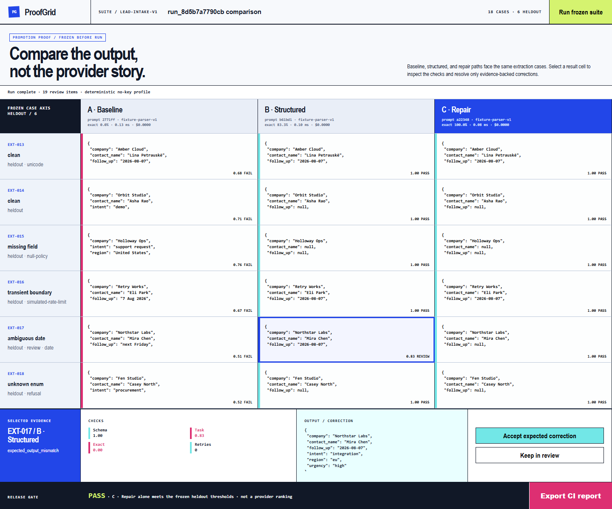

# ProofGrid

ProofGrid is a local-first reliability workbench for comparing LLM prompts,
models, schemas, and repair strategies against the same versioned cases. It
tracks output quality, latency, token use, cost, retries, validation failures,
and human corrections in one inspectable run.



[Open the live evaluation workspace](https://sutasmantas.github.io/llm-evaluation-workbench/)

## What it handles

- JSONL and CSV case imports with frozen train/held-out splits;
- versioned prompt, schema, provider, pricing, and rubric configuration;
- exact, JSON-schema, diff, and application-specific scorers;
- baseline-versus-candidate comparisons with promotion thresholds;
- retry, parse, validation, latency, token, and cost evidence;
- persistent review corrections and recomputed promotion decisions;
- JSON and CSV exports for client reports or CI gates;
- imported observations from an application's real provider path.
- executable agent/task evaluation through a pinned Inspect AI log boundary.

The included run compares baseline, schema-constrained, and bounded-repair
paths over 18 extraction and classification cases. Six cases are held out, and
the promotion thresholds are fixed before execution.

## Quickstart

```powershell
python -m venv .venv
.\.venv\Scripts\python.exe -m pip install -e ".[dev]"
.\.venv\Scripts\proofgrid.exe run --require-winner --output .proofgrid\run.json
.\.venv\Scripts\proofgrid.exe serve --host 127.0.0.1 --port 8765
```

Open `http://127.0.0.1:8765` to compare candidates, inspect case-level
differences, resolve review items, and export the run.

## Connect a model or application

For an OpenAI-compatible candidate, set:

```text
PROOFGRID_PROVIDER_BASE_URL=https://your-provider.example/v1
PROOFGRID_PROVIDER_API_KEY=...
PROOFGRID_PROVIDER_MODEL=...
```

Optional `*_INPUT_COST_PER_MILLION` and `*_OUTPUT_COST_PER_MILLION` values add
cost accounting. A separate judge can be configured with the corresponding
`PROOFGRID_JUDGE_*` variables.

Existing applications can import their own observations without replacing
their provider adapter:

```powershell
.\.venv\Scripts\proofgrid.exe import-observations `
  --bundle .proofgrid\candidate-a.json `
  --bundle .proofgrid\candidate-b.json `
  --db .proofgrid\runs.sqlite3
.\.venv\Scripts\proofgrid.exe reviews --db .proofgrid\runs.sqlite3 --status open
```

The observation contract preserves configuration versions, pricing, rubric,
first-useful timing, review state, and case-level comparison evidence.

## Evaluate an executable agent task

Install the separate Inspect environment and run the provider reference:

```powershell
python -m uv sync --extra dev --extra inspect
python -m uv run --extra inspect inspect eval `
  evals/proofgrid/inspect_reference.py@proofgrid_inspect_reference `
  --model mockllm/model --log-dir .proofgrid/inspect-logs --log-format json
python -m uv run --extra inspect proofgrid import-inspect `
  --log <generated-json-log> --require-pass --output .proofgrid/inspect-result.json
```

Inspect owns task execution and the raw versioned log. ProofGrid's
`json_schema_contract` scorer validates consumer-owned JSON Schema oracles,
then `import-inspect` rejects unversioned tasks, the wrong Inspect revision,
missing scores, sample errors, and contract failures before normalizing the
run into ProofGrid's result and decision structure. The legacy `doc` extra and
the `inspect` extra are intentionally declared incompatible because their
upstream `docstring-parser` ranges do not overlap; use separate environments.

## Verification

```powershell
.\.venv\Scripts\python.exe -m pytest -q py\autoevals\test_json.py py\autoevals\test_serializable_data_class.py py\proofgrid
.\.venv\Scripts\python.exe -m black --check py\proofgrid
.\.venv\Scripts\python.exe -m isort --check-only py\proofgrid
.\.venv\Scripts\python.exe -m flake8 py\proofgrid
.\.venv\Scripts\python.exe -m pytest -q py\proofgrid\test_inspect_integration.py
.\.venv\Scripts\proofgrid.exe run --require-winner
.\.venv\Scripts\proofgrid.exe export --format csv --output .proofgrid\cases.csv
```

See [the observation integration guide](docs/CONTEXTSIDECAR_OBSERVATION_INTEGRATION.md)
for the versioned bundle and cross-application workflow.
See [the Inspect executable-evaluation boundary](docs/INSPECT_EXECUTABLE_EVALUATION.md)
for ownership, import gates, mutation evidence, and claim limits.
